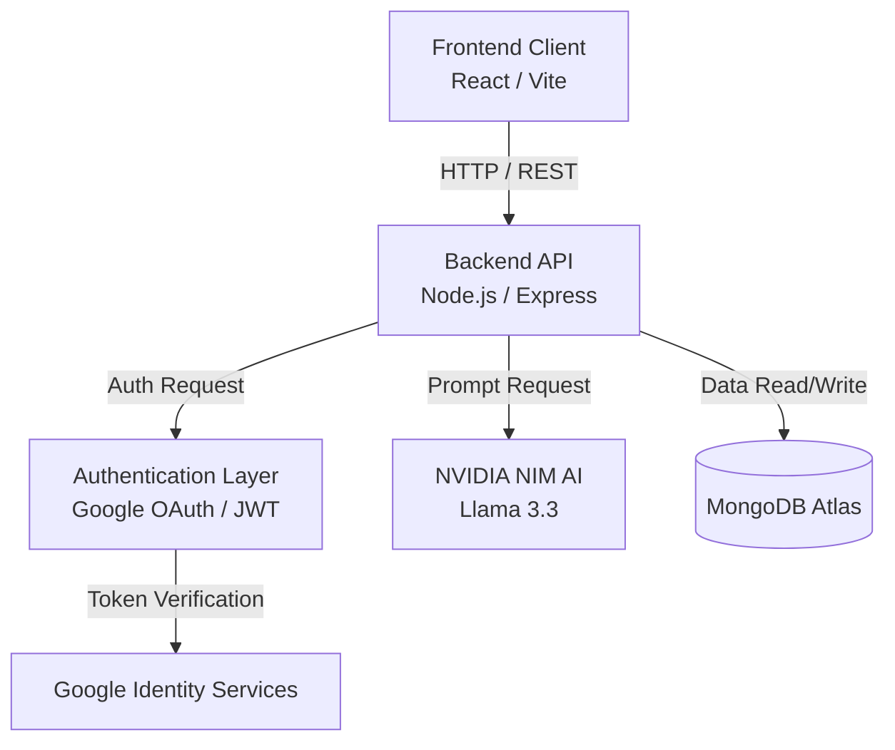
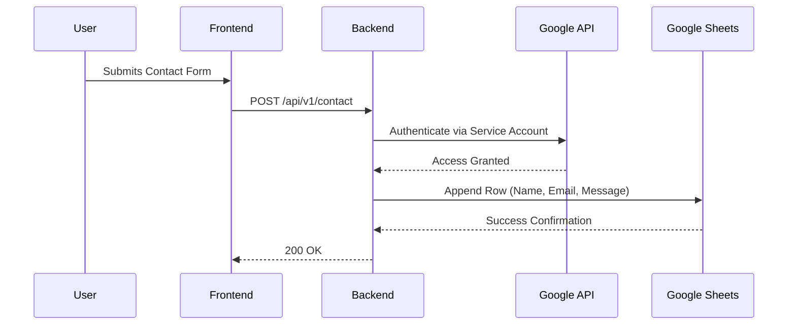

<div align="center">
  
  
  # MATRIX AI – Premium AI Powered Fitness Platform
  
  
  
  
  
  
  
  
</div>

---

## 📖 Project Overview

**MATRIX AI** is an enterprise-grade, highly interactive, AI-powered fitness platform designed to deliver a premium user experience. Built with modern web technologies and 3D web graphics, it acts as a digital biomechanical command center for fitness enthusiasts. 

The platform provides an ecosystem of health features including:
- **AI Coach**: A conversational AI powered by NVIDIA NIM to suggest conditioning splits, calculate macros, and answer fitness queries.
- **Workout Generator**: Personalized hypertrophy and metabolic circuit intervals.
- **Nutrition Planner**: Dynamic diet suggestions based on user goals.
- **Progress Tracking**: Real-time visualization of health metrics like hydration and BMI.
- **Authentication**: Secure, stateless authentication via Google OAuth and JWT.
- **Membership**: Interactive tiers for Pro, Elite, and Starter plans.
- **Dashboard**: A highly responsive, glassmorphism-styled command center.

---

## ✨ Features

| Feature | Description | Status |
| :--- | :--- | :---: |
| **Authentication** | Secure email/password login and JWT-based session management. | ✅ |
| **Google OAuth** | 1-click frictionless sign-in/up via Google Identity Services. | ✅ |
| **MongoDB** | Highly scalable NoSQL database for structured and unstructured data. | ✅ |
| **Dashboard** | Comprehensive user dashboard to track BMI, calories, and hydration. | ✅ |
| **AI Chat** | Real-time, streaming AI conversational interface using NVIDIA models. | ✅ |
| **Workout Planner** | Procedurally generated fitness routines based on user data. | ✅ |
| **Diet Generator** | Macro-nutrient breakdown and meal scheduling. | ✅ |
| **Responsive UI** | Mobile-first, fully responsive Tailwind CSS layouts. | ✅ |
| **Dark Theme** | Sleek, modern dark mode with neon accents (#39FF14). | ✅ |
| **Animations** | Fluid micro-interactions powered by Framer Motion & React Three Fiber. | ✅ |

---

## 🛠️ Tech Stack

- **Frontend**: React (v18), TypeScript, Tailwind CSS, Framer Motion, TanStack Router, React Three Fiber (Drei)
- **Backend**: Node.js, Express.js, Mongoose
- **Database**: MongoDB Atlas
- **Authentication**: Google OAuth 2.0, Passport.js (Concepts), JSON Web Tokens (JWT), HTTP-Only Cookies
- **Deployment**: Vercel (Frontend & Serverless Backend), Render (Alternative Backend)
- **AI**: NVIDIA NIM API (Llama 3.3 70B Instruct)

---

## 📂 Folder Structure

```text
MATRIX-GYM/
├── backend/
│   ├── api/                 # Vercel serverless entry points
│   │   └── index.js
│   ├── src/
│   │   ├── config/          # Database & Environment configurations
│   │   ├── controllers/     # Route logic (auth, AI, user)
│   │   ├── middleware/      # JWT verification, Error handling, Rate limiting
│   │   ├── models/          # Mongoose Schema Definitions
│   │   ├── routes/          # Express route declarations
│   │   ├── app.js           # Express app setup and global middlewares
│   │   └── server.js        # Local development entry point
│   ├── .env                 # Backend Secrets
│   ├── package.json         
│   └── vercel.json          # Serverless deployment configuration
│
├── frontend/
│   ├── src/
│   │   ├── assets/          # Images, 3D models, and static media
│   │   ├── components/      # Reusable React components (UI, Auth, 3D Canvas)
│   │   ├── data/            # Local JSON mocks
│   │   ├── hooks/           # Custom React hooks (useAuth, useReveal)
│   │   ├── lib/             # Utility functions (Tailwind merge, fetchers)
│   │   ├── routes/          # TanStack Router page definitions
│   │   ├── router.tsx       # Router configuration
│   │   └── styles.css       # Global CSS and Tailwind directives
│   ├── .env                 # Frontend Variables
│   ├── package.json
│   ├── vite.config.ts       # Vite bundler configuration
│   └── tsconfig.json        # TypeScript configuration
```

---

## 🏗️ Architecture



### Layer Explanation
1. **Frontend**: Handles all user interactions, UI rendering, 3D contexts, and routes.
2. **Backend**: Acts as the central nervous system, handling rate-limiting, CORS, routing, and business logic.
3. **Authentication**: Manages stateless sessions using HTTP-only cookies and verifies Google OAuth access tokens.
4. **MongoDB**: Stores persistent state for users, memberships, and historical fitness progress.
5. **AI**: External microservice integration via NVIDIA NIM to process conversational data and return fitness advice.

---

## 🔐 Authentication Flow

1. **Google OAuth**: When a user clicks "Google Sign Up", the frontend calls Google's Identity services to retrieve an `access_token`.
2. **Passport.js / Token Verification**: The `access_token` is sent to the backend `/api/v1/auth/google`. The backend validates the token directly against Google's `userinfo` endpoint to prevent spoofing.
3. **MongoDB User Creation**: If the user's email does not exist in the DB, a new document is created mapping the `googleId` and `email`.
4. **JWT**: A JSON Web Token is signed using a secret key and the user's `_id`.
5. **Cookies**: The JWT is attached to an `httpOnly`, `secure` cookie and sent to the client. This protects against XSS attacks.
6. **Session Management**: Subsequent requests to protected routes automatically include the cookie. The backend `protect` middleware verifies the JWT and attaches `req.user`.

---

## 📊 Google Sheets Integration

### Purpose
To provide a non-technical administration interface where gym owners can view form submissions (e.g., Contact Forms, Offline Registration requests) without needing direct database access.

### Architecture & Workflow


### Configuration
- **Service Account**: Created in Google Cloud Console. Generates a JSON key file.
- **Permissions**: The Google Sheet must be shared (Editor access) with the Service Account email.
- **Spreadsheet ID**: Extracted from the URL of the Google Sheet and placed in the `.env` file.
- **Write Operation**: The backend uses the `googleapis` library to perform an `append` operation to the specific sheet range.

---

## 🗄️ MongoDB Collections

1. **Users**: Stores `firstName`, `lastName`, `email`, `password` (hashed), `googleId`, `fitnessGoal`, `age`, `height`, and `weight`.
2. **Chats** *(Upcoming)*: Stores historical conversations between the user and the Matrix AI Coach.
3. **Workouts** *(Upcoming)*: Stores generated and custom workout routines.
4. **Nutrition** *(Upcoming)*: Stores meal plans and caloric tracking logs.
5. **Membership** *(Upcoming)*: Tracks subscription tiers (Starter, Pro, Elite), payment status, and expiration dates.
6. **Progress** *(Upcoming)*: Time-series data tracking weight fluctuations, BMI changes, and strength PRs.

---

## 📡 API Documentation

| Method | Route | Description | Auth Required |
| :--- | :--- | :--- | :---: |
| `POST` | `/api/v1/auth/register` | Register a new user via Email/Password | ❌ |
| `POST` | `/api/v1/auth/login` | Authenticate user & receive JWT cookie | ❌ |
| `POST` | `/api/v1/auth/google` | Verify Google Token & receive JWT cookie | ❌ |
| `POST` | `/api/v1/auth/logout` | Clear the JWT cookie to log out | ✅ |
| `GET` | `/api/v1/auth/me` | Fetch currently authenticated user profile | ✅ |
| `POST` | `/api/v1/ai/chat` | Send prompt to Matrix AI and get response | ✅ |
| `GET` | `/api/v1/health` | Check backend server status | ❌ |

---

## ⚙️ Environment Variables

### Backend `.env`
```env
PORT=5050
NODE_ENV=production
MONGO_URI=mongodb+srv://<user>:<password>@cluster.mongodb.net/matrix
JWT_SECRET=your_super_secret_jwt_key
JWT_EXPIRES_IN=7d
CLIENT_URL=https://matrix-fitness-source.vercel.app
NVIDIA_API_KEY=nvapi-your-nvidia-api-key
NVIDIA_BASE_URL=https://integrate.api.nvidia.com/v1
NVIDIA_MODEL=meta/llama-3.3-70b-instruct
```

### Frontend `.env`
```env
VITE_API_URL=https://server-ashy-rho.vercel.app/api/v1
```

---

## 🚀 Installation

### 1. Clone the repository
```bash
git clone https://github.com/DivyanshDobhal/MATRIX-GYM.git
cd MATRIX-GYM
```

### 2. Setup MongoDB
- Create a cluster on MongoDB Atlas.
- Get your connection string and add it to `backend/.env`.

### 3. Run Backend
```bash
cd backend
npm install
npm run dev
```

### 4. Run Frontend
```bash
cd frontend
npm install
npm run dev -- --port 3000
```

---

## 📸 Screenshots

| Homepage | Dashboard |
| :---: | :---: |
|  |  |

| AI Coach | Authentication |
| :---: | :---: |
|  |  |

---

## 🌍 Deployment

- **Frontend (Vercel)**: Deployed using the Vite preset. The `VITE_API_URL` environment variable is injected during the build step.
- **Backend (Vercel)**: Deployed as Serverless Functions using the `@vercel/node` builder. The MongoDB connection is instantiated at the top level of `api/index.js` to ensure it boots on cold starts.
- **Database**: Hosted globally on MongoDB Atlas.
- **Google OAuth**: Configured in Google Cloud Console with authorized JavaScript origins pointing to the Vercel production URLs.

---

## 🤖 How AI Works

1. **Prompt**: The user types a fitness question (e.g., "Give me a 3-day split").
2. **Request**: The React frontend sends a POST request to `/api/v1/ai/chat` with the prompt.
3. **Express Middleware**: Validates the JWT to ensure the user is authenticated.
4. **NVIDIA API**: The backend constructs a system prompt contextualizing the AI as "Matrix, an elite fitness coach" and forwards the payload to the NVIDIA NIM API (Llama 3.3).
5. **Response & Rendering**: The AI response is parsed and sent back to the frontend, where it is beautifully rendered in the Matrix AI Chat window using a typewriter effect.

---

## 🧩 Code Explanation (Explain Every Part)

### Frontend
- **Routes (`src/routes`)**: Uses TanStack Router for type-safe, file-based routing.
- **Components (`src/components`)**: Modular UI pieces. `ui/` contains Shadcn-style primitives. `site/` contains page-specific layouts. `three/` contains React Three Fiber canvas elements.
- **Hooks (`src/hooks`)**: E.g., `useAuth.tsx` manages global context for user sessions and provides methods for `login()`, `register()`, and `logout()`.

### Backend
- **Controllers (`src/controllers`)**: Contains the core business logic (e.g., `authController.js` handles password comparisons and JWT generation).
- **Middleware (`src/middleware`)**: `auth.middleware.js` intercepts requests, extracts the JWT from the cookie, verifies it, and rejects unauthorized access.
- **Models (`src/models`)**: Defines the Mongoose schemas (e.g., `User.js`), enforcing data validation at the database layer.
- **Utilities (`src/utils`)**: Helper functions for standardized API responses and external API wrappers.

---

## 🎓 Possible Viva / Interview Questions

<details>
<summary><b>1. Why did you choose MongoDB?</b></summary>
MongoDB's schema-less nature allows for highly flexible data models, which is perfect for fitness tracking where user metrics and workout structures can vary drastically from person to person. It also scales horizontally very well.
</details>

<details>
<summary><b>2. Why did you use JWT instead of sessions?</b></summary>
JWT allows for stateless authentication. Since our backend is deployed on Vercel as Serverless Functions, keeping state (like a session store in memory) is impossible. JWTs carry the state within the token itself.
</details>

<details>
<summary><b>3. How are you storing the JWT?</b></summary>
The JWT is stored in an HTTP-Only, Secure cookie. This prevents malicious JavaScript (XSS attacks) from reading the token via `document.cookie`.
</details>

<details>
<summary><b>4. Why use Express.js?</b></summary>
Express is lightweight, highly customizable, and has a massive ecosystem of middleware (like helmet, cors, morgan) which drastically speeds up API development.
</details>

<details>
<summary><b>5. How does Google OAuth work in this project?</b></summary>
The frontend requests an access token from Google. It sends this token to the backend. The backend makes a server-to-server call to Google's `userinfo` API to verify the token and fetch the user's email and profile picture. We then generate our own JWT for internal authorization.
</details>

<details>
<summary><b>6. Why React and Vite?</b></summary>
React provides a robust component-based architecture. Vite replaces Create React App (Webpack) by using native ES modules, making local server startup and HMR (Hot Module Replacement) nearly instantaneous.
</details>

<details>
<summary><b>7. How does the AI integration work?</b></summary>
We utilize NVIDIA's NIM API to access the Llama 3.3 70B model. The backend acts as a secure proxy to hide the `NVIDIA_API_KEY`. It constructs a specialized system prompt to restrict the AI to fitness-related topics before querying the model.
</details>

<details>
<summary><b>8. How do you handle CORS?</b></summary>
Using the `cors` middleware in Express, we explicitly allow our Vercel frontend URLs and `localhost` to make requests. We also configure it to allow credentials (cookies) to pass through cross-origin requests.
</details>

<details>
<summary><b>9. What is a Serverless Function?</b></summary>
A serverless function (like on Vercel) is a piece of code that spins up on-demand when a request hits the endpoint, executes the logic, and spins down. It requires no infrastructure management.
</details>

<details>
<summary><b>10. How do you manage database connections in a Serverless environment?</b></summary>
Since serverless functions are ephemeral, we must connect to MongoDB at the top-level execution context (outside the route handler) and configure Mongoose to utilize connection caching to prevent opening thousands of connections.
</details>

*(Additional Questions)*
11. **Why Tailwind CSS?** Utility-first CSS allows for rapid prototyping without leaving the JSX file.
12. **What is Framer Motion?** A production-ready motion library for React that makes complex animations declarative.
13. **How do you secure passwords?** In a production environment, passwords are hashed using `bcryptjs` before being saved to MongoDB.
14. **What is TanStack Router?** A fully type-safe router for React that prevents broken links and handles data loading.
15. **Why React Three Fiber?** It allows us to render WebGL 3D contexts declaratively within React components.
16. **What is `req.user`?** A custom object attached to the Express request object by our Auth middleware.
17. **How does rate limiting work?** `express-rate-limit` keeps track of IP addresses and blocks requests if they exceed a specific threshold (e.g., 100 requests / 15 mins).
18. **Why use Helmet?** It secures Express apps by setting various HTTP headers to mitigate common web vulnerabilities.
19. **What is a Mongoose Schema?** A blueprint defining the structure, default values, and validation rules for documents in a MongoDB collection.
20. **How do you handle errors globally?** An Express error-handling middleware (4 arguments: `err, req, res, next`) catches unhandled exceptions and formats them uniformly.
21. **What is the purpose of `.env`?** To store sensitive secrets (API keys, DB URIs) outside of the source code repository.
22. **Why deploy Frontend and Backend separately?** Separation of concerns. It allows them to scale independently and use optimized hosting providers (Vercel for CDN/Edge caching, Render/AWS for stateful APIs).
23. **How do you prevent NoSQL injection?** By using Mongoose which casts data to specific types, and by utilizing input sanitization middleware.
24. **What is the Virtual DOM?** A lightweight memory representation of the actual DOM that React uses to compute the minimal number of changes required during updates.
25. **What are React Hooks?** Functions that let you "hook into" React state and lifecycle features from functional components.
26. **How does Google Sheets API authentication work?** It requires a Service Account JSON key which utilizes a JWT to request short-lived access tokens from Google.
27. **What is SSR?** Server-Side Rendering. Our frontend utilizes Nitro to pre-render HTML on the server for faster First Contentful Paint (FCP) and better SEO.
28. **How do you handle responsive design?** Using Tailwind's mobile-first breakpoint prefixes (`sm:`, `md:`, `lg:`).
29. **What is an HTTP-Only cookie?** A cookie that cannot be accessed via client-side scripts (`document.cookie`), mitigating XSS risks.
30. **What is the difference between `PUT` and `PATCH`?** `PUT` replaces the entire resource, while `PATCH` applies partial modifications.

---

## 🚨 Troubleshooting

- **Google OAuth Fails**: Ensure your Vercel deployment URL is added to the "Authorized JavaScript origins" and "Authorized redirect URIs" in the Google Cloud Console.
- **MongoDB Timeout (`buffering timed out after 10000ms`)**: Ensure `MONGO_URI` is correctly set in your Vercel Environment Variables and that `connectDB()` is called in `api/index.js`.
- **CORS Errors**: Verify that `CLIENT_URL` in the backend exactly matches the frontend URL (no trailing slashes).
- **JWT Undefined**: Ensure your client is making requests with `withCredentials: true` (Axios) or `credentials: 'include'` (Fetch) so cookies are sent.

---

## 🔮 Future Improvements

- **Payments Integration**: Stripe integration for processing Pro and Elite membership subscriptions.
- **Wearables & Health API**: Syncing directly with Apple HealthKit and Google Fit to pull real-time step counts and heart rates.
- **AI Voice Coach**: Utilizing Web Speech API and ElevenLabs to give the Matrix AI Coach a real, motivational voice.
- **Exercise Form Detection**: Web-cam based pose estimation using TensorFlow.js to correct weightlifting form in real-time.

---

## 🤝 Contributors

- **Divyansh Dobhal** - *Full Stack Developer & Architect*

## 📜 License

This project is licensed under the MIT License - see the LICENSE file for details.

## 🙏 Acknowledgements

- [React Three Fiber](https://docs.pmnd.rs/react-three-fiber/)
- [TailwindCSS](https://tailwindcss.com/)
- [Lucide Icons](https://lucide.dev/)
- [NVIDIA NIM AI](https://build.nvidia.com/)
